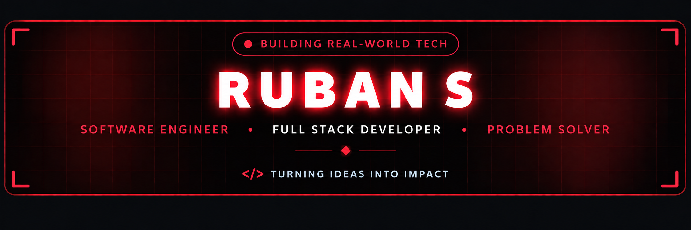

  

  
  &nbsp;
  
  &nbsp;
  
  &nbsp;
  

  

<h2 align="center">🔴 About Me</h2>

  

  

  Hey! I'm <b>Ruban S</b>, a <b>B.Tech Artificial Intelligence & Data Science student and software developer</b> from India. 
  I build full-stack web applications, backend systems, AI-powered features, and practical developer tools using modern web technologies.

  
  &nbsp;
  
  &nbsp;
  

  💬 <b>Let's Discuss:</b> Java, JavaScript, React, Node.js, Express, MongoDB, REST APIs, DSA & System Architecture. 
  ⚡ <b>Philosophy:</b> <i>"Build it, understand it, and keep improving it."</i>

<table width="100%" border="0" align="center">
<tr>
<td width="50%" align="center" style="padding: 14px;">
  <h4>🔭 Project</h4>
  
<a href="https://prepforge-ua5k.vercel.app/login" target="_blank"><b>PrepForge</b></a> AI-Powered Placement Preparation Platform

</td>
<td width="50%" align="center" style="padding: 14px;">
  <h4>🌱 Active Deep Dives</h4>
  
<b>Backend & Database Engineering</b> DSA • PostgreSQL • AI Systems

</td>
</tr>
<tr>
<td width="50%" align="center" style="padding: 14px;">
  <h4>🧠 Problem Solving</h4>
  
<a href="https://leetcode.com/u/S_RUBAN/" target="_blank"><b>LeetCode</b></a> 351 problems solved

</td>
<td width="50%" align="center" style="padding: 14px;">
  <h4>🤝 Collaboration</h4>
  
<b>AI, Web & Backend</b> Open to building practical software

</td>
</tr>
</table>

<h2 align="center">🔴 Project</h2>

<table width="100%" border="0" align="center">
<tr>
<td align="center" style="padding: 22px;">

<h3>🚀 PrepForge — AI-Powered Placement Preparation Platform</h3>

<i>A full-stack MERN platform that tracks DSA progress, synchronizes LeetCode data,
identifies weak areas, and generates AI-powered preparation insights.</i>

  
  &nbsp;&nbsp;
  

</td>
</tr>
</table>

🧩 What makes PrepForge interesting

Full-stack MERN architecture — React + Vite frontend with Node.js + Express backend and MongoDB.

Asynchronous processing — BullMQ + Redis background jobs for non-blocking LeetCode synchronization.

Real-time communication — Socket.IO for live synchronization and status updates.

AI-powered analysis — Gemini API for coding-performance analysis and personalized preparation recommendations.

Layered backend design — Routes → Controllers → Services → Providers → Database.

Secure application design — JWT authentication, password hashing, validation, protected routes, and environment-based configuration.

Analytics dashboard — DSA progress, topic coverage, weak-area analysis, and preparation insights.

<h2 align="center">📱 Projects</h2>

<b>CampusVoice — Smart Complaint Management System</b>

 

<a href="https://campusvoice-five.vercel.app/" target="_blank">Live Demo</a> ·
<a href="https://github.com/rubanofficial/campusvoice" target="_blank">GitHub</a>

An AI-powered complaint management platform for educational institutions with
anonymous and authenticated complaint submission.

<b>Stack:</b> React.js • Node.js • Express.js • MongoDB • JWT • Gemini API

<ul>
<li>Anonymous and identified complaint submission.</li>
<li>JWT-based authentication and role-based access for Admin, Staff and User.</li>
<li>Complaint status tracking and resolution workflow.</li>
<li>Gemini-powered sentiment, priority and keyword analysis.</li>
<li>Graceful fallback when the external AI service is unavailable.</li>
<li>Responsive React + Tailwind CSS interface.</li>
</ul>

<b>AI Compliance Monitoring System</b>

 

<a href="https://github.com/rubanofficial/AI-COMPLIANCE-MONITORING-SYSTEM" target="_blank">GitHub</a>

An AI-assisted compliance monitoring project combining a React frontend,
Node.js + Express backend, rule-based processing, AI analysis and PostgreSQL-oriented
data architecture.

<b>Resume Parsing & Email Extraction</b>

 

<a href="https://github.com/rubanofficial/resume-parsing" target="_blank">GitHub</a>

Python utilities for extracting, cleaning and correcting email addresses from
resume text and other unstructured input.

<b>Stack:</b> Python • FastAPI • Regex • RapidFuzz

<h2 align="center">💼 Experience</h2>

SAN Technovation Pvt Ltd — Software Engineering Intern

<b>Aug 2025 – Sep 2025</b>

Python FastAPI spaCy Regex RapidFuzz

Built a hybrid name-extraction engine combining spaCy NER with rule-based filtering for unstructured resume text.

Designed an email normalization and validation pipeline using Regex and RapidFuzz fuzzy matching.

Implemented preprocessing, extraction, validation, and correction workflows using Python and FastAPI.

<h2 align="center">🧠 AI & Data Science</h2>

  
  
  
  

  <b>AI tools used across projects:</b> 
  Gemini API • spaCy • Regex • RapidFuzz • Data Processing • AI-assisted Analytics

<h2 align="center">🧩 LeetCode Problem Solving</h2>

  <i>Consistent practice across core DSA patterns and interview-oriented problem solving.</i>

  

  
  &nbsp;&nbsp;
  

  Arrays • Strings • Sliding Window • Binary Search • Linked Lists • Stack • Trees • Graphs • BFS • DFS • Topological Sort • Shortest Path • Union-Find • Dynamic Programming • Backtracking • Greedy • Trie • Heap • SQL

<h2 align="center">🛠️ Tech Stack & Skills</h2>

<b>Core Programming Languages</b>

  

<b>Frontend Development</b>

  

<b>Backend, APIs & Databases</b>

  

<b>Tools & Engineering</b>

  

  
  
  
  
  
  

<h2 align="center">🎓 Education & Certification</h2>

<table width="100%" border="0" align="center">
<tr>
<td width="50%" align="center" style="padding: 18px;">

<b>🎓 B.Tech — Artificial Intelligence & Data Science</b> 
Kongu Engineering College 
2023 – 2027 
CGPA: 7.76

</td>

<td width="50%" align="center" style="padding: 18px;">

<b>🏅 MongoDB Associate Developer</b> 
MongoDB Inc.

</td>
</tr>
</table>

<h2 align="center">📊 GitHub Analytics & Activity</h2>

  
  &nbsp;&nbsp;
  

  

<h2 align="center">🏆 Highlights</h2>

  
  
  
  

<h2 align="center">⚡ Contribution Journey</h2>

  

<h2 align="center">📬 Let's Connect & Collaborate</h2>

  <i>Interested in full-stack development, backend engineering, AI-powered applications, or DSA?</i> 
  <b>Let's build something useful.</b>

<table border="0" align="center">
<tr>

<td align="center" width="220" style="padding: 16px;">
  <a href="https://www.linkedin.com/in/ruban-s" target="_blank">
    
      
    
  </a>
   
  <b>Professional Network</b>
</td>

<td align="center" width="220" style="padding: 16px;">
  <a href="mailto:rubans082005@gmail.com">
    
      
    
  </a>
   
  <b>Direct Collaboration</b>
</td>

<td align="center" width="220" style="padding: 16px;">
  <a href="https://github.com/rubanofficial" target="_blank">
    
      
    
  </a>
   
  <b>Projects & Code</b>
</td>

</tr>
</table>

  

